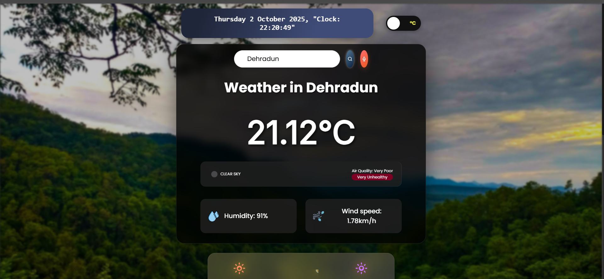
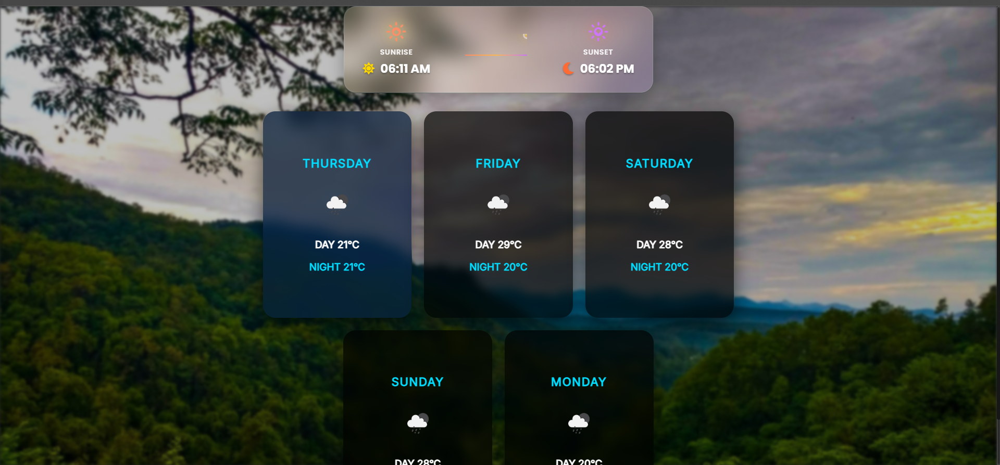

# 🌦️ Weather App

A beautiful and feature-rich weather application that provides real-time weather information and a 7-day forecast for any location. With a stunning and intuitive interface, checking the weather has never been more enjoyable.

## Screenshots






---

## 🌟 About The Project

This Weather App is designed to provide a seamless and visually appealing experience for users to get the latest weather updates. It's built with modern web technologies and integrates multiple APIs to deliver accurate and comprehensive weather data. The dynamic background changes according to the weather conditions, making the user experience more immersive.

---

## ✨ Key Features

* **Real-time Weather Data:** Get the current temperature, humidity, wind speed, and weather description for any city.
* **7-Day Forecast:** Plan your week ahead with a detailed 7-day weather forecast.
* **City Search:** Easily search for weather information for any city in the world.
* **Geolocation:** Automatically fetches weather data for your current location.
* **Unit Conversion:** Switch between Celsius and Fahrenheit with a single click.
* **Dynamic Backgrounds:** The background of the app changes based on the current weather conditions and time of day.
* **Sunrise & Sunset Times:** Stay informed about the sunrise and sunset times, beautifully displayed with a sun progress arc.
* **Air Quality Index (AQI):** Get real-time information about the air quality in your area.
* **Share on WhatsApp:** Share the current weather information with your friends and family on WhatsApp.
* **Voice Search:** Use your voice to search for a city's weather.
* **Responsive Design:** The application is fully responsive and works on all devices.

---

## 🛠️ Built With

* **HTML5**
* **CSS3** (with Sass)
* **JavaScript (ES6)**
* **Bootstrap**
* **OpenWeatherMap API:** For weather and forecast data.
* **Pexels & Unsplash APIs:** For dynamic background images.
* **ipapi.co:** For IP-based geolocation.

---

## 🚀 Getting Started

To get a local copy up and running, follow these simple steps.

### Prerequisites

You need to have a modern web browser to run this application.

### Installation

1.  **Clone the repository:**
    ```sh
    git clone [https://github.com/anantbutola/weather-app.git](https://github.com/anantbutola/weather-app.git)
    ```
2.  **Navigate to the project directory:**
    ```sh
    cd weather-app
    ```

### API Key Setup

1.  **Get your API keys:**
    * **OpenWeatherMap:** Sign up on the [OpenWeatherMap website](https://openweathermap.org/api) to get your free API key.
    * **Pexels:** Create an account on [Pexels](https://www.pexels.com/api/) to get your API key.

2.  **Create the configuration file:**
    * In the `config` folder, create a new file named `config.js`.
    * Add your API keys to this file in the following format:

    ```javascript
    export default {
      API_KEY: "YOUR_OPENWEATHERMAP_API_KEY",
      PEXELS_API_KEY: "YOUR_PEXELS_API_KEY"
    };
    ```

3.  **Open `index.html` in your browser:**
    * You can simply open the `index.html` file in your preferred web browser to see the application in action.

---

## Usage

* The weather for your current location will be displayed on page load.
* Use the search bar to find the weather for any other city.
* Click on the temperature unit to toggle between Celsius and Fahrenheit.
* Click on the weather icon to change the background image.
* Use the microphone icon for voice search.
* Click the WhatsApp icon to share the weather details.
